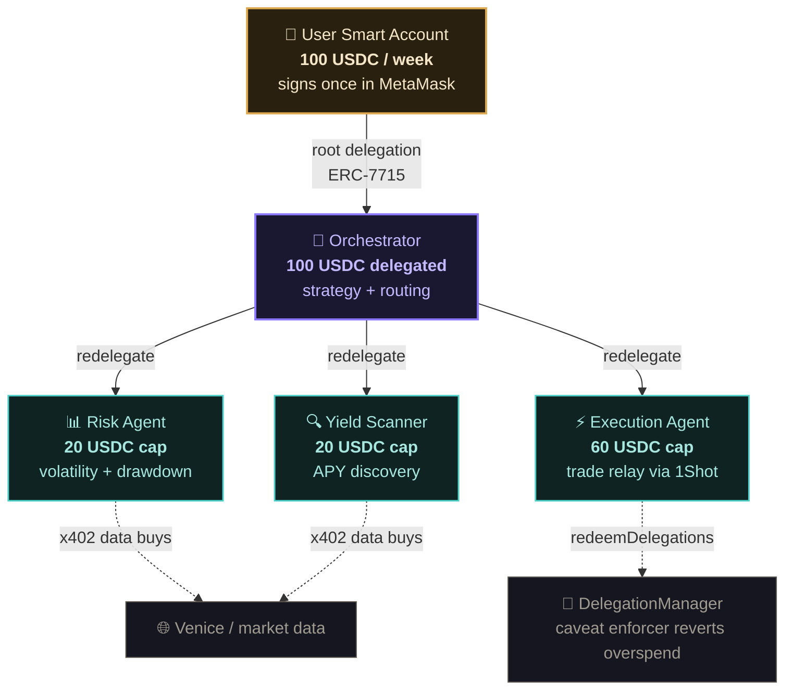
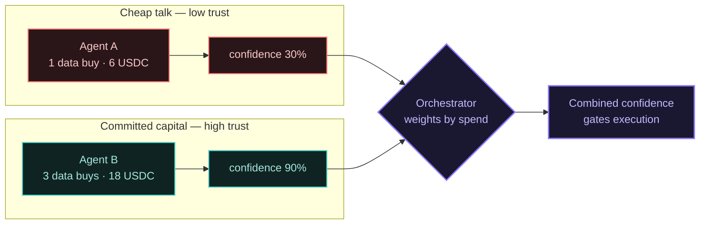
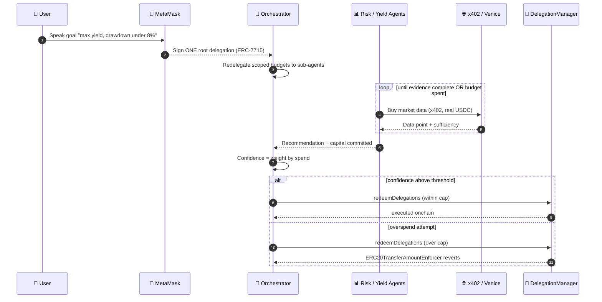

# Intento

**Agentic DeFi portfolio management where every agent's budget is enforced by the contract, not the code — and trust is earned by spending real capital on evidence.**

A user speaks one goal in plain English. Intento deploys a hierarchy of AI agents — each holding a cryptographically scoped ERC-7710 delegation — that buy market data, reason about strategy, and execute rebalances. The user signs once. The chain enforces every limit.

| | |
|---|---|
| Network | Base Sepolia (84532) for delegation + redemption · Base mainnet for 1Shot/Venice x402 |
| Stack | MetaMask Smart Accounts Kit · ERC-7710 redelegation · Venice/Groq · x402 · 1Shot |
| Signer | Any MetaMask (signer-agnostic) — uses Smart Accounts delegations, no Flask required |

---

## The delegation hierarchy

One human signature fans out into a cryptographically-scoped agent hierarchy. Each redelegation can only **narrow** its parent's authority (ERC-7710 attenuation), and every cap is enforced onchain by a caveat enforcer.



---

## Two things make Intento different

### 1. The redelegation chain actually executes onchain

Most agentic delegation demos sign a delegation tree and stop there — the sub-agents are placeholder addresses nobody controls, so nothing is ever redeemed. **Intento's sub-agents are real keypairs.** The chain `user → orchestrator → risk agent` is redeemed through MetaMask's `DelegationManager`, which walks the full authority chain onchain.

We prove enforcement both ways, live:

- **Redeem within cap** → the Risk Agent transfers 1 USDC (≤ its 20 USDC cap) → **succeeds**, real tx.
- **Attempt overspend** → the Risk Agent tries 40 USDC (> cap) → **reverts** with `ERC20TransferAmountEnforcer:allowance-exceeded`.

The revert is the entire thesis: no amount of AI reasoning can exceed the budget, because the caveat enforcer rejects it at the contract level.

### 2. Data spend IS the confidence signal (novel mechanism)

Agents don't just *say* they're confident. Each agent buys market data iteratively via x402 — every purchase costs real USDC, capped onchain by its delegation. The agent keeps buying until its evidence is complete or its budget runs out. **The orchestrator weights each agent's recommendation by how much capital it committed to evidence.**

This is costly signaling: an agent cannot fake confidence cheaply. Trust is earned with spend, not claimed with text. We have not seen this mechanism in any other submission.



---

## Track-by-track proof (open the file, verify the claim)

| Track | Where | What to verify |
|-------|-------|----------------|
| **Best A2A Coordination** | `frontend/src/lib/redelegate.ts`, `src/agents/proof.ts` | Real `user → orchestrator → risk/yield/execution` redelegation chain, **redeemed onchain** through `redeemDelegations`. Sub-agents are real funded keypairs. |
| **Best Agent** | `src/orchestrator/cycle.ts`, `src/agents/risk.ts`, `src/agents/yield.ts` | Autonomous cycle: intent → iterative data buys → confidence gate → strategy → execution. |
| **Best Use of Venice AI** | `src/intent/parser.ts`, `src/agents/*.ts` | Venice powers intent parsing + all agent reasoning. (Provider-agnostic; runs on Groq for dev — see Honest Limitations.) |
| **Best x402 + ERC-7710** | `src/agents/risk.ts` (iterative buys), `tests/src/04-x402-venice.ts` | x402 data purchases funded by ERC-7710 delegated budget. |
| **Best 1Shot Relayer** | `src/agents/execution.ts`, `tests/src/03-1shot.ts` | 1Shot relay path (Base mainnet). We verified the real API: `relayer_getCapabilities` / `relayer_getFeeData` / `relayer_sendTransactions`, mainnet-only. |

---

## The flow



---

## Run it

Backend:
```bash
npm install
cp .env.example .env   # set GROQ_API_KEY (free) or VENICE_API_KEY
npx tsx src/server.ts
```

Frontend:
```bash
cd frontend && npm install && npx next dev
```

Check funding before the onchain proof:
```bash
npx tsx src/check-setup.ts
```

---

## Validation tests

The five integration points were validated before building (`tests/src/`):

| Test | Result |
|------|--------|
| `01-permissions` | ERC-7715 / Smart Account delegation creation + signing ✅ |
| `02-redelegation` | User → orchestrator → agent chain, valid authority linkage ✅ |
| `03-1shot` | 1Shot reachable; Base mainnet only (testnet unsupported) ✅ |
| `04-x402-venice` | Venice returns 402; `@metamask/x402` wiring works ✅ |
| `05-combined` | Full chain wiring end-to-end ✅ |

---

## Honest limitations

We optimize for clarity over hand-waving:

- **LLM provider:** development runs on Groq (free, OpenAI-compatible, same Llama 3.3 70B). Flipping `LLM_PROVIDER=venice` swaps to Venice. We only claim the Venice track when running on Venice.
- **x402 cost model:** the iterative data-buy cost (6 USDC/call) is modeled to demonstrate the costly-signaling mechanism; live Venice x402 settlement is on Base mainnet.
- **Chains:** delegation + onchain redemption + the enforcement-revert proof run on Base Sepolia (free). 1Shot and Venice x402 are Base-mainnet-only, so those are demonstrated separately.
- **Smart account funding:** the enforcement proof moves USDC from your MetaMask smart account; fund it once with test USDC (`src/check-setup.ts` reports the address).

These are documented choices, not hidden stubs.

## License

MIT
